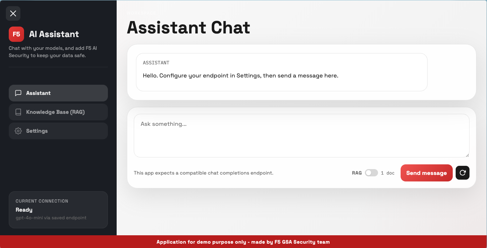

# F5 AI Assistant – Demo Application

A lightweight chat application that connects to any OpenAI-compatible LLM endpoint, with optional **F5 AI Security** guardrails and a built-in **RAG (Retrieval-Augmented Generation)** knowledge base.

> **⚠️ This application is for demonstration purposes only** — built by the F5 GSA Security team.



---

## Overview

This app provides a web-based chat interface where users can:

1. **Chat with any LLM** — Connect to OpenAI, Azure OpenAI, or any API that exposes a `/v1/chat/completions`-compatible endpoint.
2. **Enable F5 AI Security** — Optionally route both user prompts and LLM responses through [F5 AI Security (CalypsoAI)](https://www.calypsoai.com/) to detect and block unsafe content before it reaches the model or the user.
3. **Use RAG for grounded answers** — Upload `.txt` documents into a local knowledge base. When RAG is enabled, relevant context is automatically retrieved and injected into the prompt so the LLM can answer based on your own data.

---

## Architecture

```
User  ──►  Flask App  ──►  F5 AI Security (prompt scan)  ──►  LLM Endpoint
                │                                                 |
                ▼                                                 |
         RAG Engine                                               |
                                                                  │
User  ◄──  Flask App  ◄──  F5 AI Security (response scan) ◄───────┘

```

- **Prompt flow**: User message → (optional) RAG context injection → (optional) F5 AI Security scan → LLM → (optional) F5 AI Security scan → Response to user
- If F5 AI Security blocks a prompt or response, a clear message is returned instead.

---

## Project Structure

```
├── app.py              # Main app (routes, RAG endpoints, chat endpoint)
├── settings.py         # Settings blueprint (get, save, export, import config)
├── rag_engine.py       # RAG engine (chunking, FAISS indexing, retrieval)
├── rag.txt             # Default knowledge base document (default fil rag.txt loaded at startup)
├── requirements.txt    # Python dependencies
├── templates/
│   └── index.html      # Single-page HTML frontend
├── static/
│   ├── app.js          # Frontend logic (chat, settings, RAG, import/export)
│   └── styles.css      # UI styles
└── uploads/            # Uploaded RAG documents (auto-created)
```

---

## Getting Started

### Prerequisites

- Python 3.10+
- An API key for an OpenAI-compatible LLM endpoint
- *(Optional)* An F5 AI Security (CalypsoAI) account and API token

### Installation

```bash
# Clone the repository
git clone <repo-url>
cd ai-assistant-demo-app

# Create a virtual environment
python3 -m venv venv
source venv/bin/activate

# Install dependencies
pip install -r requirements.txt
```

### Run the Application

```bash
python app.py
```

The app starts on **http://localhost:8800**.

You change the port in app.py

---

## Configuration

Open the app in your browser and navigate to **Settings**:

| Field                  | Description                                              |
| ---------------------- | -------------------------------------------------------- |
| **API URL**            | Your LLM endpoint (e.g. `https://api.openai.com/v1/chat/completions`) |
| **API Key**            | Your secret API key                                      |
| **Model Name**         | Model to use (e.g. `gpt-4o-mini`)                       |
| **Enable F5 AI Security** | Toggle to enable prompt & response scanning           |
| **F5 AI Security URL** | CalypsoAI platform URL                                  |
| **F5 AI Security Token** | Your CalypsoAI API token                              |

### Import / Export Configuration

- **Export config** — Downloads your current settings as a `ai-assistant-config.json` file (including API keys).
- **Import config** — Upload a previously exported JSON file to restore settings. All fields are populated in the form, and values are saved to the server session.

---

## RAG Knowledge Base

The app includes a lightweight RAG engine powered by **FAISS** and **sentence-transformers** (`all-MiniLM-L6-v2`):

- A default document (`rag.txt`) is loaded automatically at startup. Look into it for your demos.
- Upload additional `.txt` files via the **Knowledge Base** tab.
- Toggle **RAG** on/off in the chat composer.
- When enabled, the top-3 most relevant text chunks are injected as system context before each LLM call.

---

## Dependencies

| Package               | Purpose                                  |
| --------------------- | ---------------------------------------- |
| `flask`               | Web framework                            |
| `requests`            | HTTP client for LLM API calls            |
| `calypsoai`           | F5 AI Security SDK                       |
| `sentence-transformers` | Text embeddings for RAG retrieval      |
| `faiss-cpu`           | Vector similarity search                 |

---

## License

This project is for internal demonstration purposes. Contact the F5 GSA Security team for usage inquiries.